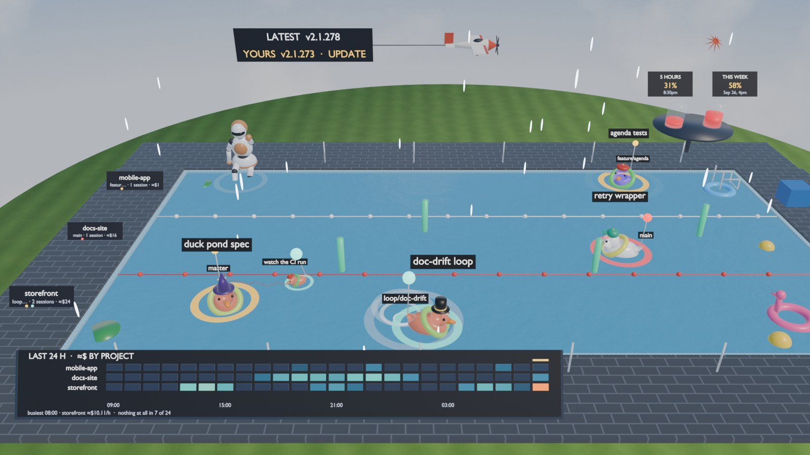
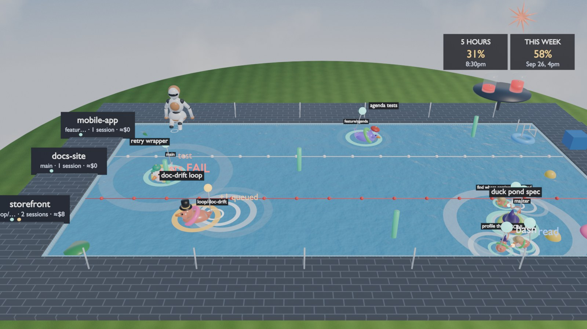
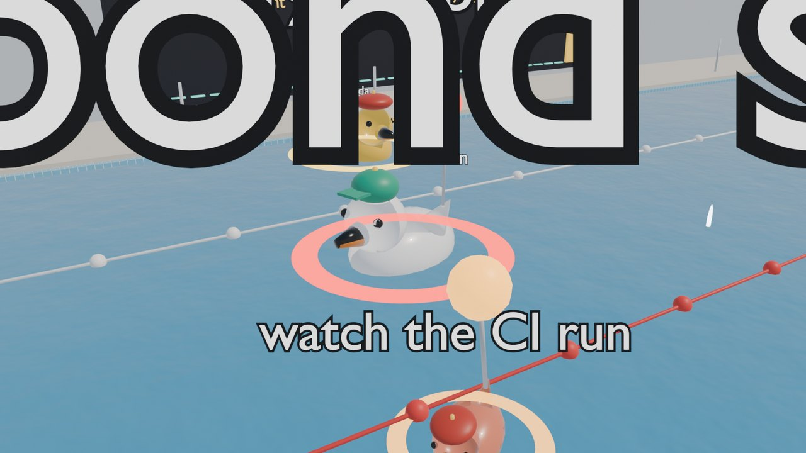
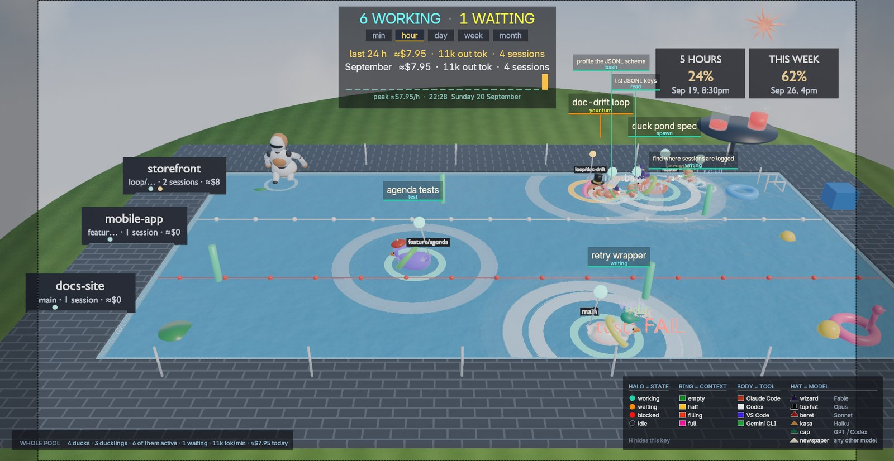
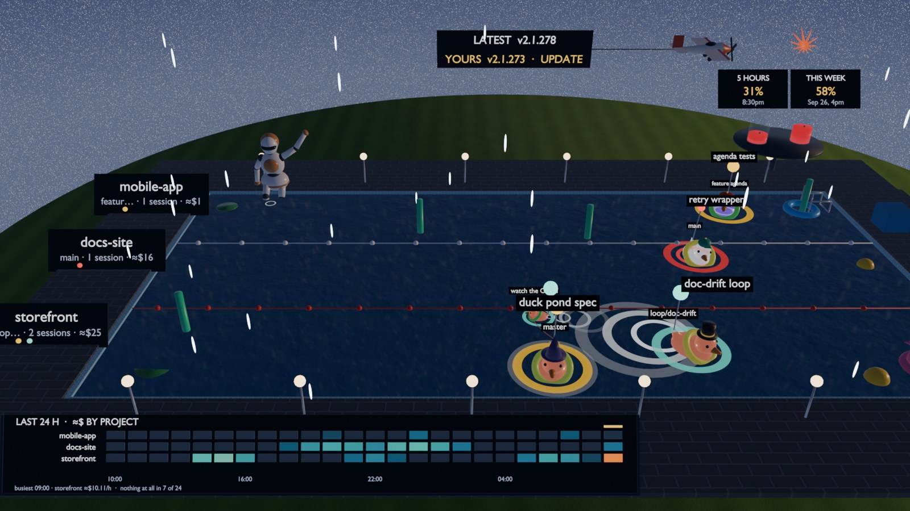
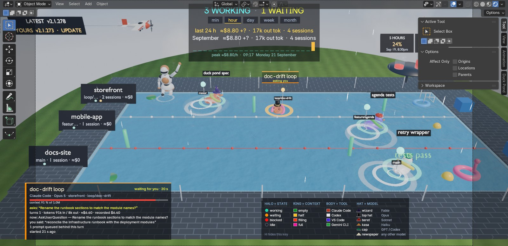

# Duck Pond

[](https://github.com/0xRabbidfly/duckpond-session-tracker/actions/workflows/ci.yml)
[](https://github.com/0xRabbidfly/duckpond-session-tracker/actions/workflows/blender.yml)
[](LICENSE)
[-orange.svg)](https://www.blender.org/download/)
[](pyproject.toml)
[](https://docs.astral.sh/ruff/)

See every AI agent working on this PC, live, at a glance, without reading logs.

A swimming pool in Blender. Every rubber duck is a Claude Code session; ducklings on tethers
are its sub-agents. Lane = working directory, hat = model, body colour = harness. Every duck
wears a **traffic light**: a lamp on a pole and a halo on the water in its state colour.
Teal = working, yellow = waiting for you (breathing; goes quiet after 10 minutes), red
flashing = blocked on a permission, no light and a greyed-out duck = idle. A key in the corner
(`H`) spells out halo, body colour and hat. Your prompts fall from the sky as amber orbs;
finished reports rise as gold ones. Every tool call pops a coloured **chip** naming it in a
word (`bash`, `edit`, `read`, `web`, `test`, `spawn`). Context compaction is a geyser. Errors
bring rain. The ring round a duck's neck is its **context meter**, green when the window is
empty and magenta when it is full. The sun follows your clock; after dark the lido lights come
on and the ducks glow. A **board** across the top of the screen carries the live count and the
spend; each lane sign on the west deck carries branches, sessions and that folder's spend; and
two **jugs of sangria** on the far deck fill with your Anthropic 5-hour and 7-day usage.
Spec: [`SPEC.md`](SPEC.md), §15 for what changed in v0.2. Code tour:
[`docs/ARCHITECTURE.md`](docs/ARCHITECTURE.md).



| | |
|---|---|
|  |  |
|  |  |

## Run it

Requires [Blender](https://www.blender.org/download/) 4.2 or newer (developed on 5.2 LTS).
The launcher finds it in the default install folder, on `PATH`, or via the `DUCKPOND_BLENDER`
environment variable. Python is only needed to build the executable or run the pure tests.

**As an executable (Windows).** Build once, then double-click `dist\DuckPond.exe` (7.8 MB, no
console window). It carries the add-on inside, unpacks it to `%LOCALAPPDATA%\DuckPond\app-<version>`
on first run, finds Blender, and starts the pool. Copy it anywhere; only Blender needs to be
installed. The log of the last run is `%LOCALAPPDATA%\DuckPond\last-run.log`.

```bat
pip install -r requirements-dev.txt
python dev\build_exe.py            # -> dist\DuckPond.exe (PyInstaller, one file, duck icon)
python dev\build_exe.py --launch   # same, then refresh every copy and relaunch --kiosk --sound

dist\DuckPond.exe                  # the pool in a maximised window (movable, minimisable), live sessions
dist\DuckPond.exe --fullscreen     # borderless fullscreen instead (Alt+F11 toggles back)
dist\DuckPond.exe --kiosk --sound  # second monitor: auto camera, tags on every duck, cues
dist\DuckPond.exe --dev            # normal Blender UI + sidebar
dist\DuckPond.exe --stub           # demo fixture (--both = demo + live)
dist\DuckPond.exe --blender "D:\Blender\blender.exe"   # if Blender is somewhere unusual
```

For an always-on second monitor, put a shortcut to `DuckPond.exe --kiosk` in `shell:startup`.

**From the repo** (same thing, via the batch files; on macOS or Linux call Blender directly):

```bat
DuckPond.cmd                    # APP MODE: pool only, maximised window, live Claude Code sessions
DuckPond.cmd --kiosk --sound    # second monitor: + auto camera, tags on every duck, sound
dev\launch.cmd                  # dev: live sessions with the normal Blender UI + sidebar
dev\launch.cmd --stub           # demo fixture (4 sessions, 5 sub-agents, 75 s loop)
dev\launch.cmd --both

blender --python dev/launch.py -- --app --kiosk --sound   # any OS
```

Blender is the app. The window is a normal one: minimise, move, maximise and snap it like
any other. Ctrl+Space restores the Blender panels, Alt+F11 toggles borderless fullscreen,
Alt+F4 quits. The **Duck Pond** tab in the sidebar (`N`) has every toggle, including a
clock override to preview the night lido.

| Key (viewport) | Action |
|---|---|
| hover | card for the duck / duckling / tether under the mouse |
| click | pin the card to that duck / duckling: it tracks it until you click elsewhere (full details in the sidebar). With [Herdr](https://herdr.dev) running, this also brings that session's terminal to the front |
| click a range tab on the board | switch the board's range: `min` `hour` `day` `week` `month` |
| `T` | cycle the board's range |
| `H` | show / hide the on-screen key (halo = state, body colour = tool, hat = model) |
| `K` | name + status tags on **every** duck (kiosk) |
| `C` | auto camera: eases in on the duck you pinned, and back out to the overview when you unpin |
| `F` | follow the pinned duck |
| `Home` | overview camera |
| `L` | cycle lane cameras |
| `S` | sound cues on/off |
| `R` | toggle text redaction (on by default) |
| `P` | pause data (scene keeps animating) |

## Reading the pool

| You see | It means |
|---|---|
| duck paddling, wake behind it | generating; a stronger wake = more tokens/sec |
| small bubbles rising from the head | thinking (the last streamed block was a thinking block) |
| head dipped, bubbles at the bill | running a tool; bubble colour = tool kind (dark = bash) |
| chip beside the duck: `bash` `edit` `read` `web` `test` `spawn` … | that tool call, just now |
| `tests pass` / `tests FAIL` chip + green/red ring | a test run finished |
| amber orb falling onto the duck, splash | you sent a prompt |
| gold orb rising, gold ring, little hop | the turn finished; the report is up |
| steady teal lamp and halo | working (generating or running a tool; the chip names the tool) |
| yellow lamp and halo, breathing | waiting for you (`asking you` chip = a question; the card quotes it) |
| yellow lamp and halo, dim and still | waiting for more than 10 minutes: quiet, not urgent |
| red lamp and halo, flashing; impatient rocking | blocked on a permission prompt (inferred from a tool unanswered > 12 s outside bypass mode) |
| no lamp, no halo, duck greyed out and see-through | idle |
| gold ring, then the duck fades out within a minute | a headless run (`claude -p` / Agent SDK) finished; it never waits for you |
| `denied` chip, red ring, head-shake | you rejected its tool call |
| amber letters stacked on the tail | prompts you typed that are queued behind this turn |
| the ring round its neck, green → yellow → orange → magenta | how full its context window is |
| duck sitting low in the water | the same thing again: a full context rides low |
| geyser + `compacted` chip, duck pops up | context compaction |
| nose down, sitting a little lower | idle |
| duckling on a thick lit tether | sub-agent working; thin dull = finished / idle |
| duckling far out on a thin leash | background sub-agent (outlives the parent's turn) |
| duckling orbiting another duckling | nested sub-agent (spawn depth 2) |
| choppy water | fleet-wide token throughput is high |
| rain | errors in the last two minutes |
| dark water, lido lamps, glowing ducks | it is after 20:30 on your clock |
| a flamingo float, a beach ball, a lily pad drifting at the edge | nothing at all; the pool is a place, not only a chart |

The board runs across the top of the screen. It reads `N WORKING · N WAITING · N BLOCKED ·
N IDLE`, then five range tabs (`min` `hour` `day` `week` `month`; click one or press `T`).
Under them: spend, output tokens and sessions for the picked range (`last 24 h`), the same for
the month so far (always), and a bar chart of spend per bucket with its peak. It is drawn in
screen space, last of everything, because it used to be a board standing on the far deck and a
duck's name tag would park on top of it for minutes at a time.

Each lane has one sign on the west deck: the folder name on top, then branches · sessions · the
folder's spend this month, then one state-coloured dot per session. Every sign is scaled by its
distance to the camera, so the far lane's sign is exactly the size of the near one instead of a
third smaller.

On the far deck stand two jugs of sangria, one per Anthropic limit window. How full a jug is, is
how much of that window you have spent; the label above it gives the percentage and when the
window clears. The numbers come from `claude -p /usage`, which is a real subprocess that spends
a few tokens, so it runs every 15 minutes by default and the pool draws the last good answer in
between. Both the toggle and the interval are in the sidebar; turn it off and the jugs empty.

Spend is an **estimate**: every reply's tokens (input, 5-minute and 1-hour cache writes,
cache reads, output) × that model's API list price, marked `≈$`. It is what the usage would
cost at API rates, not a bill; `+?` means tokens from a model with no list price. It comes from
a usage ledger that reads every transcript still on disk at startup (about a second for a month)
and follows live replies after that, so it does not drop when ducks leave or when you restart.
Claude Code deletes transcripts after about 30 days, so week and month bars reach back no further.

Glance / hover / click: the duck and its beacon are the glance; the card (state-coloured
bar, context meter, the question or denial in colour, what it is doing now, what you said,
what it said, sub-agents, queue, permission mode, tool mix of the last 10 minutes) is the
hover; the sidebar (all of that plus spend per model, sub-agent list, packets, last tools)
is the click. Packet text rides a tether only for the hovered or pinned session.

**Click a duck, get its terminal.** If you run your agents under
[Herdr](https://herdr.dev), clicking a duck also brings that session's terminal to the front:
Duck Pond asks `herdr agent list` which pane is running that Claude session id -- the same id
the duck is named for, so the match is exact -- focuses it, and raises the window hosting
Herdr. Nothing happens if Herdr is not installed, and the whole thing turns off in the
sidebar, which you may want, since focusing a terminal takes the focus off the pool.



## Data and privacy

The Claude Code adapter tails `~/.claude/projects` on a worker thread and **never writes
there**. Nothing leaves the machine. At startup it also reads the token usage of every
transcript still on disk, for the scoreboard's spend; nothing about it is stored. Beyond sessions, sub-agents, tool calls, prompts,
responses, usage and cost it reads: thinking blocks, `AskUserQuestion` (exact "asking you"),
tool denials (`toolDenialKind`), queued prompts (`queue-operation`), compaction boundaries,
turn durations, `cost-state` (lines added/removed, per-model usage), permission mode, effort,
`is_error` on tool results, and sub-agent `.meta.json` (`parentAgentId`, `spawnDepth`,
`run_in_background`). Session states other than questions and denials are inferred from
the transcript tail and marked so on the card.

Text excerpts shown on cards and tags are redacted by default (keys, tokens, long random
identifiers) and truncated. See [`SECURITY.md`](SECURITY.md).

## Contract and tests

Motion is continuous by contract: a heading never changes faster than 150°/s, walls and
ropes are avoided by steering (never by reflecting), a duck whose lane moved paddles back
instead of sliding, ducks in a lane steer apart, lanes keep their order and linger 3 min.
Personality (cruising speed, wander, bob, curiosity) lives inside that contract. The
director camera is a critically damped spring on position and look-at.

```bat
ruff check .                                               # lint (pyproject.toml)
python tests\test_core.py                                  # reducer, redaction, adapter on real logs
python tests\test_signals.py                               # questions, denials, compaction, queue, cost, inference
blender -b --python tests\headless_motion.py               # the smoothness contract (no snaps, no sawing, no sliding)
blender -b --python tests\headless_smoke.py                # builds the demo, checks every visual, renders out\smoke_eevee.png
blender -b --python tests\headless_director.py             # camera + world continuity under a busy fleet
blender -b --python dev\render_showcase.py                 # out\showcase_*.png + out\showcase_clip.mp4
blender --python dev\gui_shot.py -- --kiosk --out out\gui_tags.png   # real GUI overlay screenshot
```

CI runs the lint and the pure tests on every push, and the headless Blender tests whenever
the add-on, tests or fixtures change.

## Not built yet

- Replay mode on the timeline, Codex and VS Code adapters (stub-only ducks), GIF export.
- Exact states need a hook feed; today `awaiting_permission` is inferred from timing.
- Remote / cloud sessions do not write local logs and are not shown.
- macOS / Linux launchers. The add-on is plain `bpy`; only the `.exe` and `.cmd` files are Windows-shaped.

## Layout

```
duck_pond/
  model.py           fleet state + event reducer (signals, cues with timestamps)
  ledger.py          priced usage by minute: ranges, month to date, per session / folder spend
  pricing.py         API list prices ($/MTok) for the ≈$ estimate
  theme.py           harness colours, model → hat, state colours, tool categories, redaction
  adapters/          claude_code.py (tail follower), stub.py (fixture replay), base.py
  usage_limits.py    the 5-hour and 7-day limits, read from `claude -p /usage` on its own thread
  herdr.py           click a duck to raise its terminal in Herdr (pane lookup by session id)
  scene/             pool (water, tiled deck, lawn), duck (beacon, context ring, mail, glow),
                     tether, ripples, fx (chips, orbs, geyser, rain), deck (lane signs),
                     pitchers (the sangria jugs), props (floating toys), sky (sun, night, chop, rain)
  sim/motion.py      per-frame motion: contract, personality, separation, body language
  sim/director.py    camera: eases to the duck you pinned, critically damped; never roams
  sound.py           optional aud cues
  ui/                cards (glance/hover/click text, board model), hover (gpu/blf board,
                     card, tags, key), panel
  runtime.py         timer (data, 4 Hz) + frame handler (motion, fx, sky, director)
  addon.py           Blender registration, preferences, operators, toggles
launcher/            DuckPond.exe source (finds Blender, unpacks the add-on, starts the pool) + icon
fixtures/demo.json   scripted demo: fan-out, nested + background agents, question, denial, compaction
dev/                 launch.py|cmd, build_exe.py, render_showcase.py, gui_shot.py, render_icon.py
tests/               core, signals, ledger, usage, herdr, headless motion / smoke / director / watchdog
docs/                ARCHITECTURE.md, media/
```

## Contributing

Issues and pull requests are welcome. [`CONTRIBUTING.md`](CONTRIBUTING.md) has the setup,
the test commands, the smoothness contract and what a good change looks like. Two rules
survive everything: every kept idea must be visible in Blender, and nothing ever writes to
`~/.claude/projects`. Please follow the [code of conduct](CODE_OF_CONDUCT.md).

## License

[MIT](LICENSE) © 2026 Nuno Borges. Not affiliated with Anthropic or the Blender Foundation.
